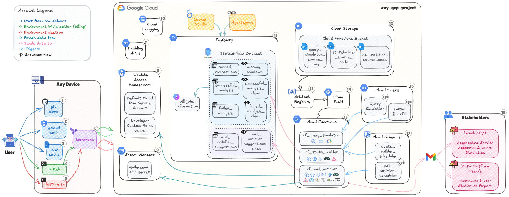
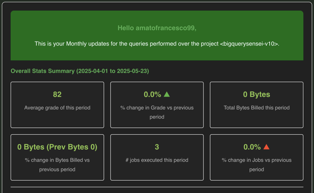
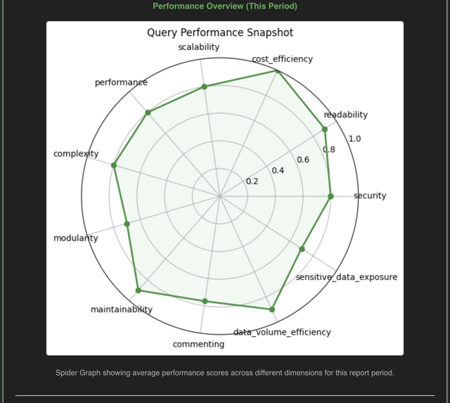
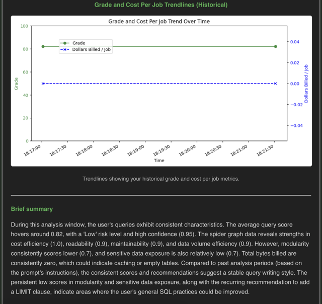
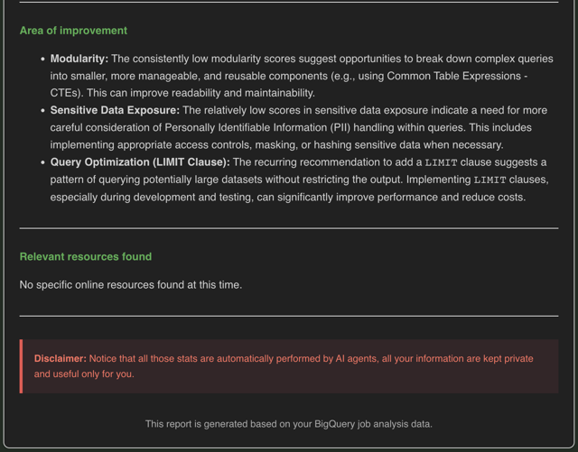
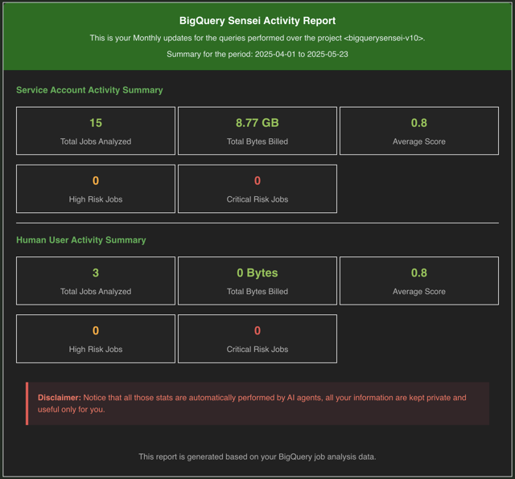

# **[`bigquery-sensei`](./): Harnessing AI Agents for Optimizing BigQuery Performance, Enhancing Efficiency, and Streamlining Data Management for Smarter Insights**

 

> [!TIP]
> **Transform your BigQuery experience and cut costs—all for just cents a day!** Powered by intelligent AI agents, **`bigquery-sensei`** automatically uncovers opportunities to supercharge query performance, significantly reduce cloud spend, and perfect your BigQuery SQL. Receive actionable, data-driven insights conveniently via automated, personalized email reports, empowering your team for continuous learning and smarter data management! 🏆

## 🌱 Aim

**`bigquery-sensei`** is a cutting-edge, open-source initiative designed to revolutionize your interaction with Google Cloud's BigQuery. We provide intelligent, automated analysis and deliver actionable insights directly to data practitioners and platform administrators.

By continuously monitoring and evaluating your BigQuery query performance, cost efficiency, and overall quality, **`bigquery-sensei`** fosters a data-driven culture where users are empowered with the knowledge to write more efficient, cost-effective, and performant SQL. Our core purpose is to transform raw query logs into valuable, personalized suggestions and reports, driving optimization and enhancing the overall BigQuery experience across your organization.

Imagine a world where your data team automatically receives tailored feedback on their queries, helping them grow their skills and reduce cloud spend – that’s the power of **`bigquery-sensei`**.

---

## 🚀 Getting Started

Getting started with **`bigquery-sensei`** is designed to be straightforward, enabling you to deploy this powerful analysis engine quickly within your Google Cloud environment. Due to the infrastructure requirements on GCP, the setup process is detailed in a separate, dedicated guide.

Please refer to the [SETUP.md](src/setup/README.md) document for comprehensive instructions on prerequisites, environment configuration, and deployment steps using the provided scripts and Terraform code.

---

## 🧠 Architecture Explained (How it Works)

**`bigquery-sensei`** operates as a robust, serverless, and batch-driven system built entirely on Google Cloud Platform, orchestrated by Terraform. The core workflow revolves around fetching BigQuery job logs, analyzing them using custom AI Agents, and delivering insights through automated reports, always validating provided information. Here’s an overview of the system’s key components:

### Key Components:
- **User Interaction**: Deployment and destruction are initiated through the provided [`init.sh`](src/setup/init.sh) and [`destroy.sh`](src/setup/destroy.sh) scripts.
- **Terraform**: Manages GCP infrastructure, including APIs, IAM roles, BigQuery datasets/tables, Cloud Storage, Cloud Functions, Cloud Scheduler jobs, Cloud Tasks queues, and Secret Manager.
- **BigQuery**: Central data warehousing for querying BQ logs (via `INFORMATION_SCHEMA`) and storage cloud functions outputs layer.
- **Cloud Storage**: Securely stores zipped source code for Cloud Functions.
- **Cloud Functions**: Performs tasks like analyzing logs, running queries, and sending reports:
  - `cf_query_simulator`: Simulates predefined SQL queries to populate initial test data (optional).
  - `cf_stats_builder`: Periodically fetches and filters relevant job logs for deep analysis with a BigQuery Jobs evaluator Agent.
  - `cf_mail_notifier`: Aggregates analyzed job data and sends personalized email reports, with a custom Agent that composes the mail content and build useful graphs.
- **Cloud Scheduler**: Cron-based scheduling for tasks like log analysis and report sending.
- **Cloud Tasks**: Triggers asynchronous tasks like backfilling historical data or query simulations.
- **Secret Manager**: Securely stores sensitive credentials.
- **IAM**: Controls access to GCP resources with fine-grained roles.
- **Cloud Logging**: Centralized logging for monitoring and debugging.

While the current implementation focuses on core analysis and email reporting, the architecture is designed for extensibility, enabling future integration with more sophisticated workflows like **Agentspace** and **Looker Studio**.

---

## ✨ Features

**`bigquery-sensei`** offers a powerful suite of features to help you optimize your BigQuery usage:

- **Automated BigQuery Job Analysis**: Fetches and analyzes job logs for insights into cost, performance, security, readability, complexity and many more (can be added).  
- **Structured Analysis Results**: Stores detailed analysis outcomes in dedicated BigQuery tables for easy querying and reporting.  
- **Failed Analysis Tracking**: Tracks and logs analysis failures for continuous pipeline improvement.  
- **Run Summary Logging**: Maintains a historical record of analysis execution, including processed job counts and missing windows.  
- **Automated User Reporting**: Sends personalized email reports summarizing information about query performance, improvements, and learning resources. This information is generated by analyzing verified sources: relevant content is extracted, sources are compared to find those adding new details, and exclusive sources are prioritized.
- **Developer Activity Monitoring**: Provides high-level usage statistics for administrators.  
- **Configurable Reporting Frequency**: Flexible email report schedules (daily, weekly, monthly).  
- **Secure Credential Management**: Sensitive credentials are stored in Google Cloud Secret Manager.  
- **Optional Query Simulation**: Simulate queries to test the analysis pipeline and initialize data.  
- **Historical Backfill**: Analyze historical data by triggering a Cloud Task for backfilling.  

---

## 🤝 Contributions

We are thrilled to welcome contributions from the community to help make **`bigquery-sensei`** even better! Your ideas, bug fixes, feature requests, and documentation improvements are highly valued and essential to the project's growth. Join us in enhancing this tool!

---

## 🤔 Why bigquery-sensei?

In modern data-driven organizations, managing BigQuery costs, query performance, and adhering to best practices can be a significant challenge. Often, users lack visibility into the true impact of their queries, leading to inefficiencies and unexpected costs. Motivating continuous improvement in query writing across a team can also be enhanced with engaging features.

**`bigquery-sensei`** addresses these challenges by:

- **Proactively Identifying Issues**: Automatically scans job logs to flag potentially costly or inefficient queries before they become major problems.
- **Empowering Users**: Provides personalized, actionable feedback and curated learning resources, directly improving individual SQL skills and understanding.
- **Driving Improvement through Gamification**: Possibility to introduce gamification features, such as user rankings, performance classifications (e.g., "Top Performer", "Needs Review"), and leaderboards, to foster friendly competition and motivate continuous improvement in query practices.
- **Providing Visibility**: Offers aggregated insights into BigQuery usage patterns team-wide, helping administrators identify cost drivers, optimization opportunities, and areas where training might be needed.
- **Leveraging Cutting-Edge AI**: Uses Large Language Models and custom AI agents to offer nuanced, human-readable recommendations that go beyond simple rule-based checks, providing deeper context.
- **Automating the Process**: Significantly reduces manual effort required for monitoring, analyzing, and providing feedback on queries across the organization.

By providing clear, automated feedback and insights, and with planned engaging features like gamification, **`bigquery-sensei`** aims to help organizations significantly optimize BigQuery costs, boost performance, and cultivate a more skilled, cost-aware, and motivated data team.

---

## 🎨 Examples

To illustrate the actionable insights and rich visualizations provided by **`bigquery-sensei`**, explore samples of the automated reports delivered to both individual users and platform administrators.

> [!NOTE]
> The values, dates, and periods presented in these examples are generated for demonstration purposes only and are fictitious. They serve solely to showcase the behavior and potential  in producing reports and analyses.

### 📧 User Reports

Personalized reports empower individual data practitioners with tailored feedback on their BigQuery query performance and cost efficiency, helping them continuously refine their SQL skills.

Below you can find a sample user report, including a **spider graph** of performance metrics and **trendlines** showing historical improvement, divided into several key sections:

> 
> 
> 
> 

### 📊 Developer Reports

Developer reports provide platform administrators and data leads with a high-level overview of activity across the organization, highlighting overall usage patterns and key statistics for human users and service accounts.

See a sample developer activity summary below:

> 